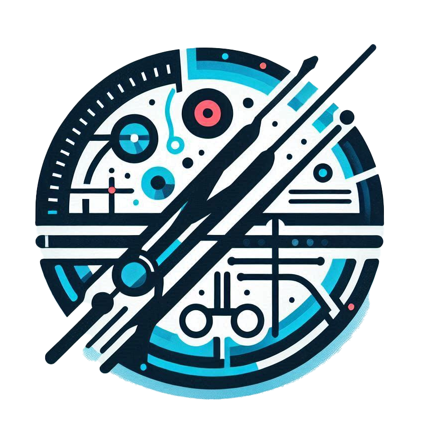

#   Bachelor Thesis - Recognizing surgical tools in action (n-pose)

This is the repository for my bachelor thesis. The goal of this thesis is
to recognize surgical tools in action. I proposed a new method (n-pose)
which tries to estimate an objects posed given a polygon describing the
object's segmentation and a list of keypoints.

For segmentation and keypoint detection, I used [YOLO](https://docs.ultralytics.com/).

## Structure

All the code is in the `src` folder. The `src` folder is structured as follows:

- `data`: Contains the data loaders and the dataset classes as well as
  methods for converting the data to the format required by the different
  models.
- `models`:  Contains functions relevant for training the different models.
- `utils`: Contains utility functions used throughout the code.
- `visualize`: Contains functions for visualizing annotations etc. by
  rendering them on the images.